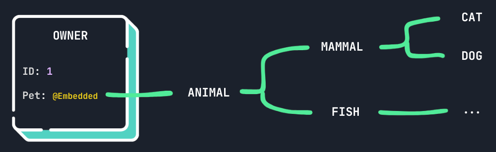

= Hibernate ORM 6.6 - Embeddable Inheritance
Marco Belladelli
:awestruct-tags: [ "Hibernate ORM", "Discussions" ]
:awestruct-layout: blog-post
:user-guide: https://docs.jboss.org/hibernate/orm/6.6/userguide/html_single/Hibernate_User_Guide.html
---

The first release candidate for Hibernate ORM `6.6` has already been released, and a final version will be available very soon. In today's blog post, I'm going to delve into a feature that has been requested for a long time but has never made it into our framework until now: Embeddable Inheritance.

[[embeddable-values]]
== What are Embeddable values

Embeddable properties have been a part of Hibernate ORM for a long time, but let me give you a quick rundown of their basic functionalities. If you already know all about embeddables and just want to hear the news, feel free to skip to the <<embeddable-inheritance,next section>>.

Embeddable types, identified by the `@Embeddable` annotation, are a *composition of values* that, unlike entities, do not directly correspond to database tables. Their state is tied to the entities they're used in as `@Embedded` properties, and they are *reusable* across different mappings. Embeddables can also be used as _composite primary keys_ through the `@EmbeddedId` or `@IdClass` annotations, and as `@ElementCollection` values.

Here's an example of a very simple embeddable type consisting of two properties:

====
[source, java, indent=0]
----
@Embeddable
class Animal {
    private int age;

    private String name;
}
----
====

And here's an entity mapping that uses it:

====
[source, java, indent=0]
----
@Entity
class Owner {
    @Id
    private Long id;

    @Embedded
    private Animal pet;
}
----
====

The database table corresponding to the `Owner` entity will include both the properties for the `Animal` embeddable:

====
[source, sql, indent=0]
----
    create table Owner (
        id bigint not null,
        age integer,
        name varchar(255),
        primary key (id)
    )
----
====

Note that embeddables can be made up of basic values as well as associations. For more in-depth information about all the possibilities embeddables offer, you can refer to link:{user-guide}#embeddables[this chapter] of the Hibernate user guide.

[[embeddable-inheritance]]
== Introducing Embeddable Inheritance

Inheritance support in Hibernate ORM, i.e. the ability to take advantage of the object-oriented fundamental concept of superclasses and subclasses with inherited properties in the domain model, has historically been restricted to entity types. After a long wait (the link:https://hibernate.atlassian.net/browse/HHH-1152[original feature request] dates back to November 2005!), we have introduced support for discriminator-column-based `@Embeddable` types inheritance.

[[how-it-works]]
==== How Embeddable Inheritance Works

Embeddable inheritance works similarly to link:{user-guide}#entity-inheritance-single-table[Single Table Entity inheritance]: an `@Embeddable` annotated class, which we'll call the root type, may be extended by other `@Embeddable` annotated classes, which will become the subtypes.

When this is the case, the `@Embedded` properties using that type will create an *additional column* in the entity mappings in which they are contained that will store information about the composite value's specific subtype (unless you use a formula-based discriminator, see how in the <<discriminator-column,following chapters>>). When retrieving the inherited property, we will read the discriminator value and instantiate the correct `@Embeddable` subtype with its corresponding properties.

Here's an example of how you can enable embeddable inheritance in your mappings. Taking from the <<embeddable-values,previous chapter's example>>, let's say the `Animal` type is extended by other embeddables:
====
[source, java, indent=0]
----
@Embeddable
class Mammal extends Animal {
    private String mother;
}

@Embeddable
class Cat extends Mammal {
    // [...]
}

@Embeddable
class Dog extends Mammal {
    // [...]
}

@Embeddable
class Fish extends Animal {
    private int fins;
}
----
====

This will enable embeddable inheritance and, on the corresponding `Owner` entity, we'll see the columns for all the subtypes properties as well as the discriminator:
====
[source, sql, indent=0]
----
    create table Owner (
        id bigint not null,
        pet_DTYPE varchar(31) not null,
        age integer,
        name varchar(255),
        mother varchar(255),
        fins integer,
        primary key (id)
    )
----
====

[NOTE]
====
Embeddable inheritance *IS* also supported for components used in an `@ElementCollection`.
Embeddable inheritance *is NOT* supported for `@EmbeddedId`, embeddable types used as `@IdClass`
and embedded properties using a custom `@CompositeType`.
====

[[why-inheritance]]
==== Why Use Embeddable Inheritance?

Embeddable inheritance is useful when you want to embed a polymorphic structure within your mapped tables, instead of relying on the entire entity mapping itself to handle inheritance. It allows for a clean and modular design, enabling code reuse and maintaining a clear separation of concerns.

[[discriminator-column]]
=== Customizing the discriminator column

By default, the discriminator column will be STRING typed and named `<property_name>_DTYPE`, where `property_name` is the name of the `@Embedded` property attribute in the respective entity mapping. It's possible to customize the discriminator column mapping:

* For the whole `@Embeddable` type, by using either a dedicated column via the `@DiscriminatorColumn` annotation or a <<discriminator-formula,native SQL expression>> based on existing properties with `@DiscriminatorFormula` on the root class of the inheritance hierarchy (NOTE: if using the same inheritance-enabled embeddable type for two different properties in the same entity mapping, this might cause a column name conflict);
* For a specific `@Embedded` property, by using the `@AttributeOverride` annotation with a special value as name: `+{discriminator}+`.

Finally, to specify custom discriminator values for each subtype, one can annotate the inheritance hierarchy's classes with `@DiscriminatorValue`.

==== Dedicated discriminator column

Storing the type of your polymorphic embedded properties in a dedicated column is the simplest solution, that allows to easily understand what embeddable subtype is contained in an entity by directly reading its value.

Here's a couple of examples of customizing the discriminator column and values stored in it:
====
[source, java, indent=0]
----
@Embeddable
@DiscriminatorColumn( name = "animal_type", length = 1 )
static class Animal {
    // [...]
}

@Embeddable
@DiscriminatorValue( "C" )
static class Cat extends Mammal {
    // [...]
}
----
====

And finally, here's an example of how an insert statement triggered by persisting an instance of `Owner` with a `Cat` embeddable instance looks like:
====
[source, sql, indent=0]
----
    insert
    into
        Owner
        (age, fins, mother, name, animal_type, id)
    values
        (3, null, 'Gatta', 'Ariel', 'C', 1)
----
====

[[discriminator-formula]]
==== Discriminator formula

You can also base your polymorphic `@Embedded` properties type on existing columns through the `@DiscriminatorFormula` annotation: by specifying a native SQL expression that will result in the subtype discriminator values, you won't need an additional discriminator-column to enable embeddable inheritance in your mappings.

Here's a very simple example usage of formula-based embeddable polymorphism:
====
[source, java, indent=0]
----
@Embeddable
@DiscriminatorFormula( "case when name like 'cat_%' then 'C' when name like 'dog_%' then 'D' [...] end" )
static class Animal {
    // [...]
}
----
====

With this mapping, no additional column will be needed to store the embedded property's subtype.
Here's how a query that reads the embedded property value looks like:
====
[source, sql, indent=0]
----
select
    o1_0.id,
    case
        when o1_0.name like 'cat_%' then 'C'
        when o1_0.name like 'dog_%' then 'D'
        -- [...]
    end,
    o1_0.age,
    o1_0.name,
    o1_0.mother,
    o1_0.fins
from
    Owner o1_0
----
====

Discriminator formulas are very flexible, allowing the discriminator value to be derived from any native SQL expression.

[[type-treat]]
== Support for `type()` and `treat()` operators

Of course, the `type()` and `treat()` functions are also supported for embeddable inheritance and can serve to explicitly refer to the type information of `@Embedded` properties in queries.

[[hql-function-type]]
===== `type()`

The function `type()` evaluates to the concrete type, that is, the Java `Class`, of the referenced entity or embeddable:
====
[source, java, indent=0]
----
Class<?> petType = entityManager.createQuery( // <1>
    "select type(o.pet) " +
    "from Owner o " +
    "where o.id = 1",
    Class.class)
.getSingleResult();

List<Owner> catOwners = entityManager.createQuery( // <2>
    "select o " +
    "from Owner o " +
    "where type(o.pet) = Cat",
    Owner.class)
.getResultList();
----
<1> Retrieve the type of an embeddable property
<2> Restrict the embeddable property to a specific subtype
====

This allows you to interact with polymorphic embeddable types directly in queries.

[[hql-function-treat]]
===== `treat()`

The function `treat()` may be used to narrow the type of an identification variable:
====
[source, java, indent=0]
----
List<Owner> owners = entityManager.createQuery(
    "select o " +
    "from Owner o " +
    "where treat(o.pet as Cat).mother = :mother",
    Owner.class)
.setParameter( "mother", mother )
.getResultList();
----
====

Once again, see the types and typecasts link:{user-guide}#hql-functions-typecasts[user guide chapter] for more details.

[[benefits-and-limitations]]
== Benefits and Limitations

In conclusion, I've listed here a couple benefits and limitations that characterize this new feature:

*Benefits*:

* *Code reusability*: Common fields are defined in the parent embeddable classes, promoting reuse and reducing redundancy.
* *Polymorphic queries*: You can use the `type()` and `treat()` functions to handle polymorphic queries effectively.

*Limitations*:

* *Not supported for composite ids*: inheritance is not supported for embeddables used as primary keys.
* *Complexity*: Managing discriminator columns can add complexity to your database schema, especially when dealing with multiple embeddable properties.

[[outlooks]]
== Outlooks

Embeddable inheritance in Hibernate ORM provides an additional tool for designing clean, modular, and reusable data models. By leveraging discriminator columns, our framework allows you to map complex inheritance hierarchies to relational database structures seamlessly. While it adds a layer of complexity, the benefits in terms of code maintainability and query capabilities often outweigh the downsides.

As always, we're open to improvement requests and discussions about the new features we implement. If you want to let us know what you think of this topic or if you have any questions, please reach us through the link:https://hibernate.org/community/[usual channels].